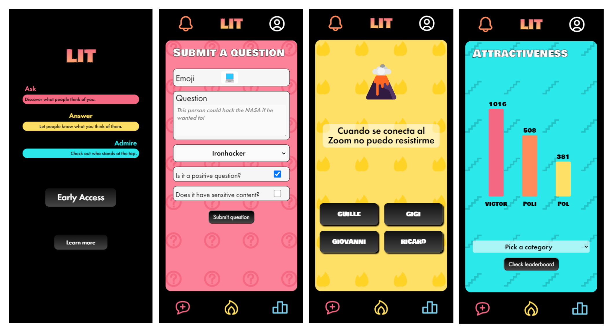
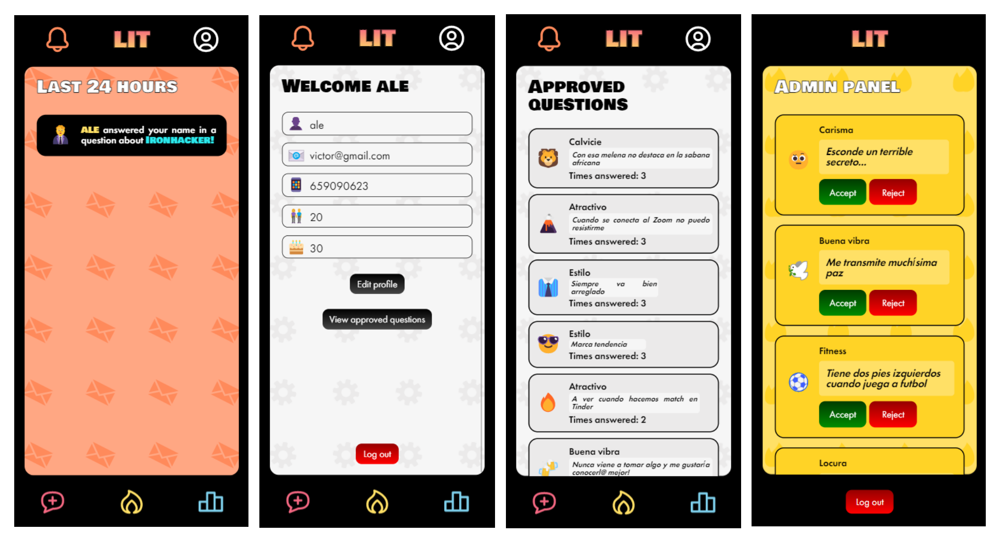

# Lit

## Description

This is a project developed by Alberto Menéndez and Víctor Perdiguer as the project for the second module at Ironhack.

The purpose of the application is to build a social app that allows its users to answer questions about other users anonymously.

The questions will always have other users as its possible answer, single choice only.

The results of these answers are then used to elaborate a leaderboard based on several categories.

Users can also propose new questions so that other users can answer them. These questions will have to be reviewed by the admin team before being allowed on the platform to avoid toxicity.

---

## Instructions

When cloning the project, change the <code>sample.env</code> for an <code>.env</code> with the values you consider:
```js
PORT=3000
MONGO_URL='mongodb://localhost:27017/app-name'
SESSION_SECRET='SecretOfYourOwnChoosing'
NODE_ENV='development'
```
Then, run:
```bash
npm install
```
To start the project run:
```bash
npm run start
```

To work on the project and have it listen for changes:
```bash
npm run dev
```

---

## Wireframes




---

## User stories (MVP)

Regular users
- User can sign up and create and account
- User can login
- User can log out
- User can delete his account
- User can answer questions about other users
- User can view the leaderboard
- User can write and submit new questions
- User can view notifications when other users choose him as an answer for a question
- User can see his history of submitted questions

Admins
- Admins can view submitted questions
- Admins can approve/deny submitted questions

## User stories (Backlog)

- On first login, users are forced to answer a question before doing anything else
- Users can join different circles with independent questions and leaderboards
- Include different types of questions

---

## Models

#### User

```js
const userSchema = new Schema(
  {
    username: {
      type: String,
      trim: true,
      required: [true, 'Username is required.'],
      unique: true
    },
    email: {
      type: String,
      required: [true, 'Email is required.'],
      unique: true,
      lowercase: true,
      trim: true
    },
    hashedPassword: {
      type: String,
      required: [true, 'Password is required.']
    }
  },
  {
    timestamps: true
  }
)
```

#### Question

```js
const questionSchema = new Schema(
  {
    emoji: {
      type: String,
      trim: true,
      default: "😳"
    },
    question: {
      type: String,
      trim: true,
      required: [true, 'You must submit a question.'],
      unique: true
    },
    category: {
        type: String,
        enum: ['Calvicie', 'Atractivo', 'Estilo', 'Ironhacker', 'Carisma', 'Buena vibra', 'Locura', 'Fitness'],
        required: true,
    },
    // choose whether the question has a positive affect on its category or a negative one
    effect: {
      type: Boolean,
      default: true,
      required: true
    },
    // true --> question apt to everyone, false --> sensitive content
    safe: {
        type: Boolean,
        default: true,
        required: true
    },
    _approved: {
        type: Boolean,
        default: false
    },
    _author: {
        type: Schema.Types.ObjectId,
        ref: "User"
    }
  },
  {
    timestamps: true
  }
)
```

#### UserAnswer

```js
const userAnswerSchema = new Schema(
  {
    questionId: {
      type: Schema.Types.ObjectId,
      ref: "Question",
      required: true
    },
    userAsked: {
        type: Schema.Types.ObjectId,
        ref: "User",
        required: true,
    },
    userAnswered: {
        type: Schema.Types.ObjectId,
        ref: "User",
        required: true,
    },
    usersIgnored: {
        type: [Schema.Types.ObjectId],
        ref: "User",
        required: true,
    }
  },
  {
    timestamps: true
  }
)
```
---

## Routes

| Name  | Method | Endpoint    | Protected | Req.body            | Redirects |
|-------|--------|-------------|------|---------------------|-----------|
| Landing  | GET   | /           | No   |                     |           |
| Auth | GET    | /auth | Non-users only |                      |           |
| Login | GET    | /auth/login | Non-users only |                      |           |
| Login | POST    | /auth/login | Non-users only | { username, password }                     |           |
| Register | GET    | /auth/register | Non-users only |                      |           |
| Register | POST    | /auth/register | Non-users only | { username, email, password, repeatedPassword } |           |
| Profile | GET    | /profile | Users only |                      |           |
| Edit Profile | GET    | /profile/edit | Users only |                      |           |
| Edit Profile | POST    | /profile/edit | Users only | { username, email, password, phone, gender, age } |           |
| View approved questions | GET    | /profile/approved-questions | Users only |    |    |
| Logout | POST    | /profile/logout | Users only |  |           |
| Delete | POST | /profile/delete   | Users only | |          |
| Question | GET | /question   | Users only | |          |
| Question | POST | /question/:questionId  | Users only | { possibleAnswers, userAnswered } |           |
| Submit Question | GET | /submit-question   | Users only | |          |
| Submit Question | POST | /submit-question   | Users only | { emoji, question, category, effectCheck, safeCheck } |         |
| Leaderboard | GET | /leaderboard   | Users only | |          |
| Leaderboard | GET | /leaderboard?category={query}   | Users only | |          |
| Notifications | GET | /notifications   | Users only | |          |
| Admin | GET | /admin   | Admin only | |          |
| Admin | POST | /admin/:questionId   | Admin only |  { approval }   |       |

---

## Useful links

- [Github Repo](https://github.com/lit-module2/lit-project)
- [Trello kanban](https://trello.com/b/fg3dg6qD/lit-modulo2)
- [Deployed version]()
- [Presentation slides](https://slides.com/albertomenendezrodriguez/lite/)
